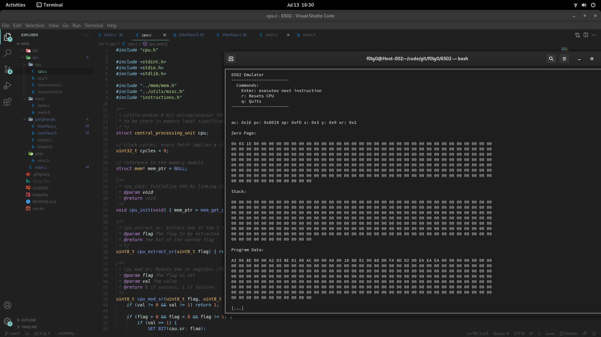

# 6502 Emulator

A minimal, single-stepped and beginner friendly 6502 emulator written in C using ncurses for graphics.



## DISCLAIMER

This main goal of this project is to understand how CPUs works by directly emulating one and to debug it by single stepping instructions. The code is meant to be readable and understandable, a lot of things could be done better, especially the graphics.

The emulator only shows you what's going on under the hood of a 6502 CPU, without displaying stuff graphically (you will only see hex digits). The example program simply caluclates `10*3` and it's not optimized.

## Run

You must have `ncurses` installed on your machine. This project was developed in a Linux environment.

```
make
```

```
./bin/emulator.out
```

Or you can run the _shortcut_ script

```
bash run.sh
```

## Code style

The paradigm I've chosen is `modular programming`, especially because this is C. System components aren't defined in a OOP way.

Everything is very verbose with a lot of comments.

## Design

The project is divided in multiple components:

-   **cpu**: here you will find the CPU itself, including main methods to interact with the memory
    -   **instructions handler**: here we handle OP codes
-   **mem**: pretty simple memory implementation, each page has a dedicated array
-   **peripherals**
    -   **interface**: everyhting ncurses related
    -   **keyboard handler**: listener for key presses

## Dump feature

After quitting, the program dumps its memory to a `.bin` file.

## Example program

The loaded program multiplies 10 by 3, in order to try it you must single step instructions until you see `1E` (30) in the third memory cell in the zero page. You can continue to single step it but nothing will happen.

## TODO

Do you want to contribute? Here are some things that are still a WIP.

-   [ ] check for errors on cpu_fetch() calls
-   [ ] add remaining comments to `instructions.c`
-   [ ] create a better interface

## References

-   [obelisk.me.uk/6502](http://www.obelisk.me.uk/6502/)
